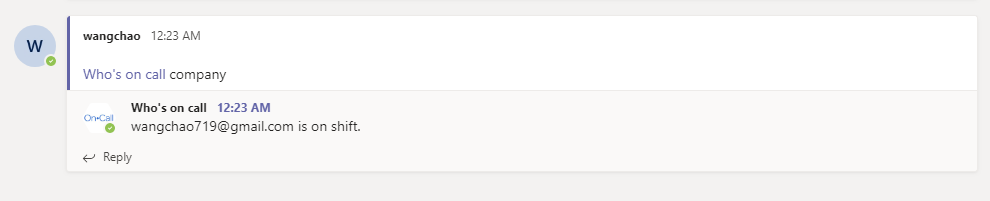

# WhoIsOnCall



# Microsoft Teams outgoing webhook

This project is an implementation of a very simple [Outgoing Webhook](https://docs.microsoft.com/en-us/microsoftteams/platform/concepts/custom-bot) for Microsoft Teams. All it does is verify that what's sending messages matches the Outgoing Webhook that was created in Teams, and it echoes back whatever is sent to it.

## Steps to run locally

### Prerequisites

* Install Git for windows: https://git-for-windows.github.io/

* Clone this repo:
  ```bash
  git clone https://github.com/OfficeDev/msteams-samples-outgoing-webhook-nodejs.git
  ```

* Install Node: https://nodejs.org/en/download/    

* Install a tunnelling service. These instructions assume you are using ngrok: https://ngrok.com/

* Start the tunneling service, e.g. `ngrok http 8080` and copy the https:// URL it generates to the clipboard, e.g. https://2fb7b5e8.ngrok.io

* Create the Outgoing Webhook in Teams using the instructions [here](https://docs.microsoft.com/en-us/microsoftteams/platform/concepts/custom-bot). Paste the tunneling service URL from the previous step into the "Callback URL" box. After you press the Create button, copy/paste the security token that Teams generates to the clipboard.

* Put environments in `.env`. When you're done, it should look something like this:
```env
HMAC=<HMAC>
APIKey=<APIKey>
```

* In the directory in which you installed this project, type `node app.js`

* In Microsoft Teams, in any channel in the team in which you created the Outgoing Webhook, you can type `@<botname> hello` (or anything else you like) and it will echo back its name and what you typed.
